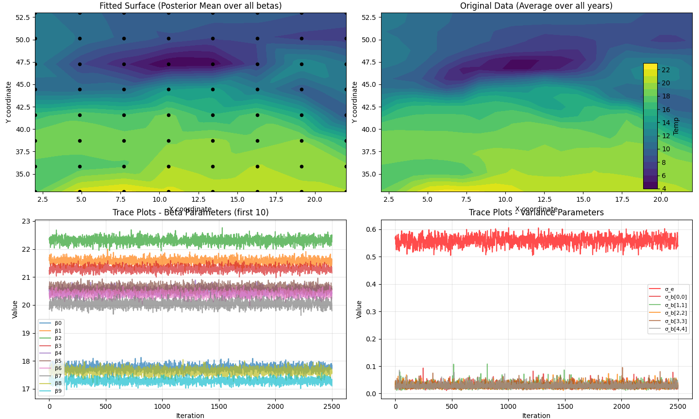

# Bayesian FEM Temperature Reconstruction

This project estimates spatial temperature profiles from gridded temperature data using a finite-element basis expansion and a hierarchical Bayesian model. Since the posterior is not available in closed form as a joint distribution, inference is performed with a Gibbs sampler. An alternative sampler uses a random-walk Metropolis-Hastings step inside the Gibbs loop for a Matérn-structured covariance.

The main 2D posterior mean surface produced by the project is:



## Model

For each year or time group $i = 1,\dots,n$, the observed mean temperatures are collected in

```math
y_i = (y_i(s_1), \dots, y_i(s_{m_i}))^\top \in \mathbb{R}^{m_i}.
```

The spatial temperature field for group $i$ is approximated by a finite-dimensional basis expansion

```math
f_i(s) = \sum_{k=1}^{K} b_{ik}\,\phi_k(s),
```

where $\phi_k$ are basis functions and $b_i \in \mathbb{R}^K$ are year-specific coefficients. In the 2D model, `FEMBasis2D` constructs first-order finite-element hat functions on a Delaunay triangulation of the spatial domain. Evaluating these basis functions at observation locations gives the design matrix

```math
X_i[j,k] = \phi_k(s_j),
```

so the observation model is

```math
y_i \mid b_i, \sigma_\varepsilon^2 \sim
\mathcal{N}\!\left(X_i b_i,\ \sigma_\varepsilon^2 I_{m_i}\right).
```

The hierarchical prior assumes that the yearly coefficient vectors fluctuate around a population-level coefficient vector $\beta$:

```math
b_i \mid \beta, \Sigma_b \sim \mathcal{N}(\beta,\Sigma_b),
\qquad
\beta \sim \mathcal{N}(0,c_\beta I_K).
```

The conjugate covariance model uses

```math
\sigma_\varepsilon^2 \sim \mathrm{InvGamma}(c_\varepsilon,d_\varepsilon),
\qquad
\Sigma_b \sim \mathrm{InvWishart}(\eta_b,S_0).
```

In the implementation, `S_b` is supplied as a scale template and the actual inverse-Wishart scale is `S_0 = eta_b * S_b`.

The posterior is proportional to

```math
p(\beta,b,\sigma_\varepsilon^2,\Sigma_b\mid y)
\propto
\prod_{i=1}^{n} p(y_i\mid b_i,\sigma_\varepsilon^2)
\prod_{i=1}^{n} p(b_i\mid \beta,\Sigma_b)
p(\beta)\,p(\sigma_\varepsilon^2)\,p(\Sigma_b).
```

## Gibbs Sampler

The code stores the residual variance in variables named `sigma_e`; mathematically this quantity is $\sigma_\varepsilon^2$. Let $v_\varepsilon = \sigma_\varepsilon^2$, $Q_b=\Sigma_b^{-1}$, and

```math
A_i = v_\varepsilon^{-1} X_i^\top X_i + Q_b.
```

`conditionals.beta_draw` implements the collapsed Gaussian full conditional for $\beta$, conditional on $y$, $v_\varepsilon$, and $\Sigma_b$, with the $b_i$ integrated out:

```math
\Lambda_\beta
= nQ_b + c_\beta^{-1}I_K
- \sum_{i=1}^{n} Q_b A_i^{-1} Q_b,
```

```math
h_\beta
= \sum_{i=1}^{n}
Q_b A_i^{-1} v_\varepsilon^{-1} X_i^\top y_i,
\qquad
\beta \mid y,v_\varepsilon,\Sigma_b
\sim \mathcal{N}(\Lambda_\beta^{-1}h_\beta,\Lambda_\beta^{-1}).
```

Given the new $\beta$, `conditionals.b_draw` samples each year-specific coefficient vector independently:

```math
b_i \mid y_i,\beta,v_\varepsilon,\Sigma_b
\sim
\mathcal{N}(\mu_{b_i},\Sigma_{b_i}),
```

```math
\Sigma_{b_i}=A_i^{-1},
\qquad
\mu_{b_i}=A_i^{-1}
\left(v_\varepsilon^{-1}X_i^\top y_i + Q_b\beta\right).
```

The residual variance update in `conditionals.sigma_e_draw` is

```math
v_\varepsilon \mid y,b
\sim
\mathrm{InvGamma}\left(
c_\varepsilon+\frac{m}{2},
d_\varepsilon+\frac{1}{2}\sum_{i=1}^{n}
\lVert y_i-X_i b_i\rVert_2^2
\right),
```

where $m=\sum_i m_i$.

The conjugate covariance update in `conditionals.sigma_b_draw` is

```math
\Sigma_b \mid b,\beta
\sim
\mathrm{InvWishart}\left(
\eta_b+n,\ 
\eta_b S_b + \sum_{i=1}^{n}(b_i-\beta)(b_i-\beta)^\top
\right).
```

`src/MCMC.py` runs these updates repeatedly, discards burn-in, and stores posterior samples of `beta`, `sigma_e`, `sigma_b`, and all year-specific coefficient vectors in `b_0`.

## Matérn Covariance Variant

`src/MCMC_MH.py` replaces the inverse-Wishart covariance draw by a Metropolis-Hastings step. The covariance is restricted to a Matérn $ \nu=3/2 $ form,

```math
\Sigma_{b,j\ell}(\rho,\sigma_b)
= \sigma_b^2
\left(1+\frac{\sqrt{3}d_{j\ell}}{\rho}\right)
\exp\left(-\frac{\sqrt{3}d_{j\ell}}{\rho}\right),
```

where $d_{j\ell}$ is the distance between basis-node indices on the square coefficient grid. The code uses log-normal priors for $\rho$ and $\sigma_b$, proposes positive random-walk perturbations, and accepts or rejects using the log posterior

```math
\log p(b\mid \beta,\Sigma_b(\rho,\sigma_b))
+ \log p(\rho)
+ \log p(\sigma_b).
```

## Project Structure

- `src/FEMBasis.py` builds 2D P1 finite-element basis functions on triangular meshes.
- `src/BSpline.py` builds 1D B-spline bases for longitude-only experiments.
- `src/conditionals.py` contains the conditional posterior samplers.
- `src/MCMC.py` runs the conjugate Gibbs sampler.
- `src/MCMC_MH.py` runs the Gibbs sampler with an MH covariance update.
- `src/sigma_distribution.py` evaluates the Matérn covariance and its log posterior contribution.
- `src/data_import.py` loads and filters the 1D and 2D temperature CSV files.
- `testing/` contains exploratory scripts, plotting scripts, and sampler checks.

## Setup

Create an environment and install the dependencies:

```bash
python -m venv .venv
source .venv/bin/activate
pip install -r requirements.txt
```

The 1D data file `df_equator.csv` is expected in the repository root. The 2D data file is expected at `data/df_equator_2D.csv`.

## Running

Run the 1D B-spline experiment:

```bash
python -m src.main
```

Run the 2D FEM Gibbs sampler:

```bash
python -m testing.main_test_2D --n-iter 5000 --n-burn 2500
```

Run the 2D FEM sampler with the Matérn covariance MH step:

```bash
python -m testing.main_test_2D --metropolis-hastings --n-iter 5000 --n-burn 2500
```

To generate saved samples for comparing the inverse-Wishart and Matérn-MH covariance models:

```bash
python -m testing.compare_IW_MH
python -m testing.compare_IW_MH_plot
```

## Posterior Reconstruction

Posterior mean temperature surfaces are reconstructed by averaging the sampled coefficients after burn-in. The population-level estimate is

```math
\widehat{f}_{\mathrm{pop}}(s)
= \sum_{k=1}^{K} \widehat{\beta}_k \phi_k(s),
\qquad
\widehat{\beta} = \frac{1}{T_{\mathrm{post}}}\sum_t \beta^{(t)}.
```

Year-specific reconstructions use

```math
\widehat{f}_i(s)
= \sum_{k=1}^{K} \widehat{b}_{ik}\phi_k(s),
\qquad
\widehat{b}_i = \frac{1}{T_{\mathrm{post}}}\sum_t b_i^{(t)}.
```

The included image visualizes the population posterior mean surface over the 2D spatial domain.
